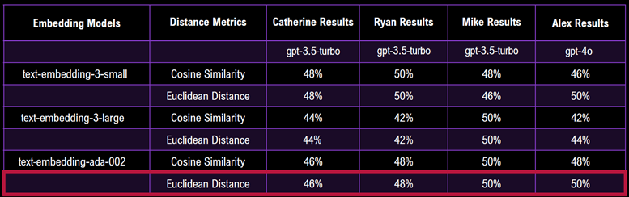
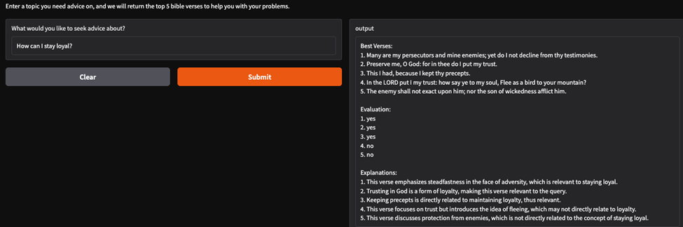

# ScriptureSeeker: An AI-Powered Bible Verse Recommendation System

**Team CRAM**  
Team Members: Alex Baraban, Catherine Wanko, Michael Nicholas, Ryan Hough  
**Submission Date**: October 31, 2024  
**Instructor**: Kevin  

## Table of Contents

1. [Project Overview](#project-overview)
2. [Project Industry](#project-industry)
3. [Data Sources](#data-sources)
4. [Key Research and Exploration Questions](#key-research-and-exploration-questions)
5. [Licensing and Legal Terms](#licensing-and-legal-terms)
6. [Additional Information](#additional-information)
7. [References](#references)

## Project Overview

**ScriptureSeeker** aims to develop a supervised learning model that assigns embeddings to Bible verses from the King James Version. Utilizing Euclidean Distance, the system retrieves the most contextually relevant verses in response to user queries. The goal is to create a model that efficiently provides appropriate biblical references based on input topics or questions.

## Project Industry

Self-Help, Inspiration

## Data Sources

- **Primary Data Source**: [Kaggle Bible Dataset (King James Version)](https://www.kaggle.com/datasets/oswinrh/bible)  
  We will use the `t_kjv` file from this dataset.

## Licensing and Legal Terms

This project is released under the [Creative Commons Zero v1.0 Universal License](https://creativecommons.org/publicdomain/zero/1.0/legalcode.en#copyright):

- **No Copyright**: Anyone is free to copy, modify, distribute, perform, and display the work, even for commercial purposes, all without asking permission.

## Data Extraction and Cleaning Process

- **Data Extraction**: 
    1. The King James version, in CSV form, is selected from the available files from the Kaggle link
    2. The CSV is then read into the Jupyter notebook as a dataframe called bible
- **Data Cleaning**: Note that each verse is accessed by a unique key, the combination of the BOOK+CHAPTER+VERSE id.
    1. The scope of the project will be limited to only referencing the Book of Psalms for applying recommendation tool.   
    2. Therefore, a new data frame will be created by applying the .loc function to limit the original Data Frame to only the Book of Psalms (referenced as 19 in the original dataset), and naming the new data frame "psalms."
    3. To further clean the data, drop columns for index, 'id' (unique key for each chapter/verse combination), and 'b' (Book), and reset the index for the revised data frame referencing.
    4. The revised data frame will include and inde for each Chapter/verse combination within the Book of Psalms.
    5. Using Chat GPT, create a sample question for each verse in the Book of Psalms that would reasonably be expected to be asked by a person, and store these questions for each verse in a dictionary.  Exclude all verses that do not have an insightful question it can answer.  And, avoid religious references in the questions.  The dictionary created in step 5 will later be used to train the model. 
    6. Create a new dataframe that will be filtered to include ONLY the verses that would be able to answer insightful questions, as defined in the prior step.  The dataframe will inlcude columns for the Chapter key, the Verse key, the verse text, and the sample questions for each verse, and will be re-indexed for the remaining "filtered" verses relevant to this application.  The new datafram will be called "filer
    7. Save the data frame to a CSV to be used in the model.

## Key Research and Exploration Questions

While this project primarily focuses on a query model using Retrieval Augmented Generation (RAG), the key challenges include:

- Developing a model that effectively retrieves relevant Bible verses based on specific input topics or queries.
- Testing the effectiveness of the query results using cosine similarity and/or Euclidean Distance to determine the relevance between the user query and the Bible verses.

## Model Evaluation

Compared the results of 6 scenarios applying 2 Distance Metrics to 3 different embedding models:

- Distance Metrics were: 
    1. Euclidean Distance, and 
    2. Cosine Similarity
- Embedding Models were:
    1. text-embedding-3-small
    2. text-embedding-3-large
    3. text-embedding-ada-002

- Success of the models was evaluated using the percentage of relevant (or "yes") responses (i.e. yes ratio), based on a sample size of 50 queries returning "yes" or "no" responses in evaluating relevance using Langchain as described above (in "Additional Information" section).
- Ryan, Catherine, and Michael evaluated the scenarios using gpt-3.5-turbo within the OPENAI LLM model.
- Alex used gpt-4o within the OPENAI LLM model in the hope of getting more definitive clarity of the best Distance Metric/Embedding Model combination.
- We ultimately selected the combination of Euclidean Distance using the text-embedding-ada-002 model as slightly better than the other 5 combinations.

**The results of the model evaluation are below...**

## Additional Information

Gradio app was created with the following functionality:

- User input related to the following prompt "What would you like to seek advice about?"
- Output provides the top 5 bible verses using Euclidean distance to select the best verses to provide guidance related to the user query.
- Use Langchain to evaluate the responses with yes or no, yes being relevant advice and no being irrelevant advice to the query
- Also, using Langchain, output will include a brief explanation why a yes or no was chosen for each of the top 5 verses

**The Gradio App interface and example of the output are shown below...**

